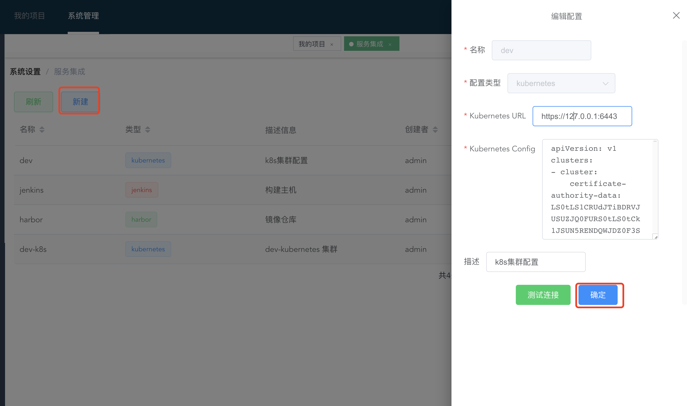
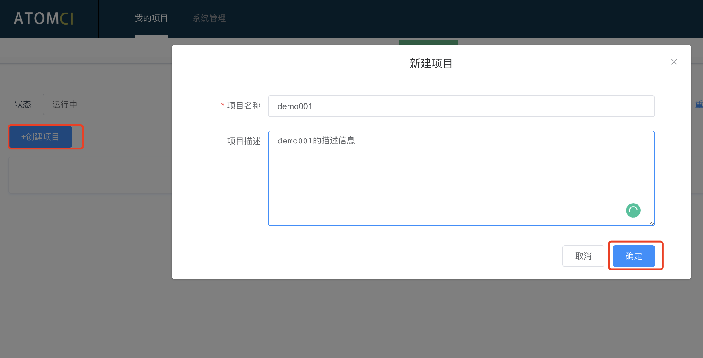
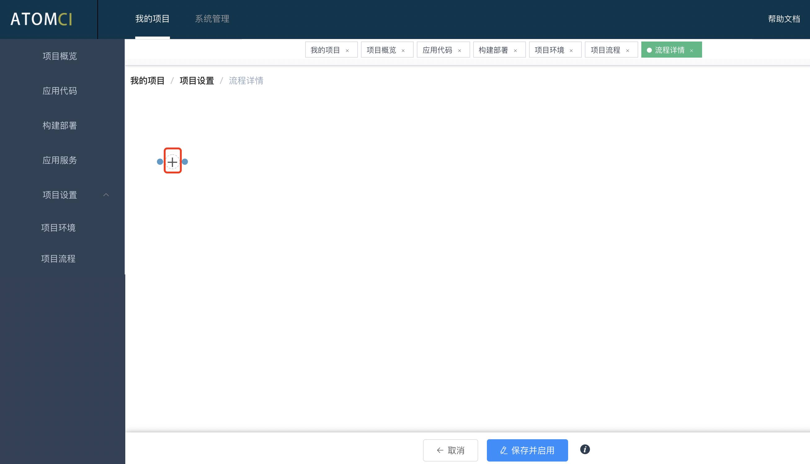
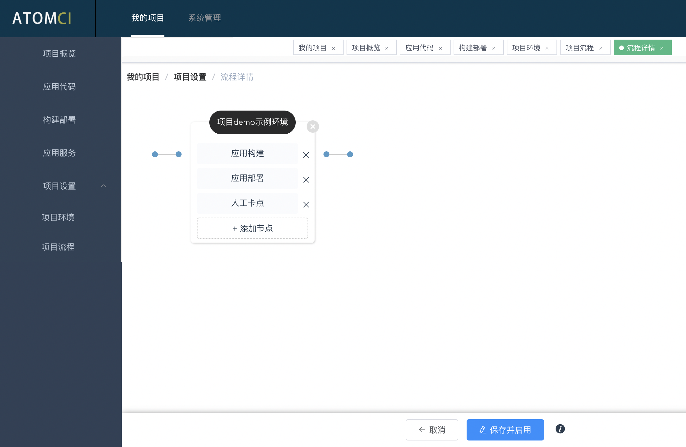
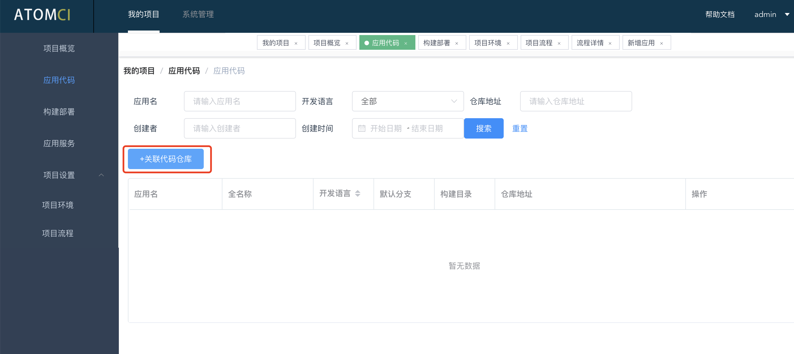
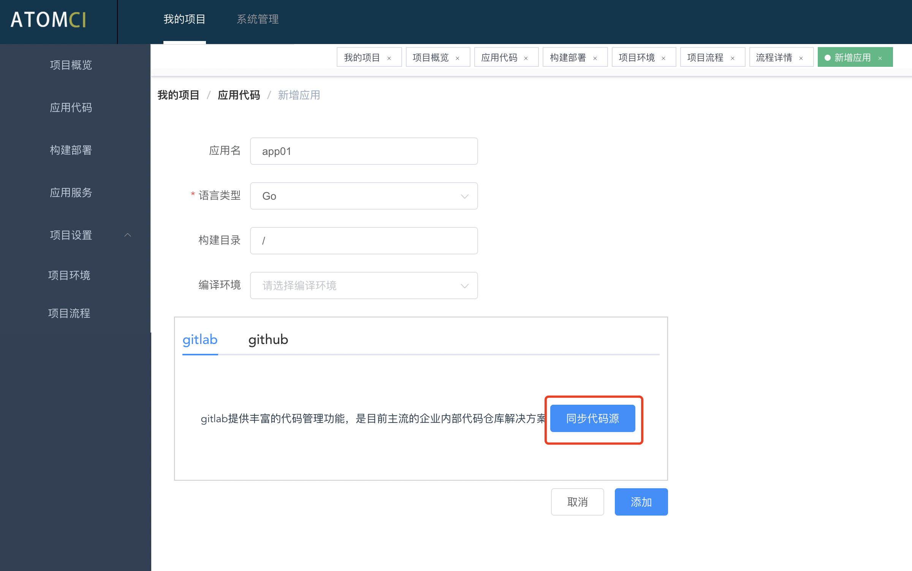
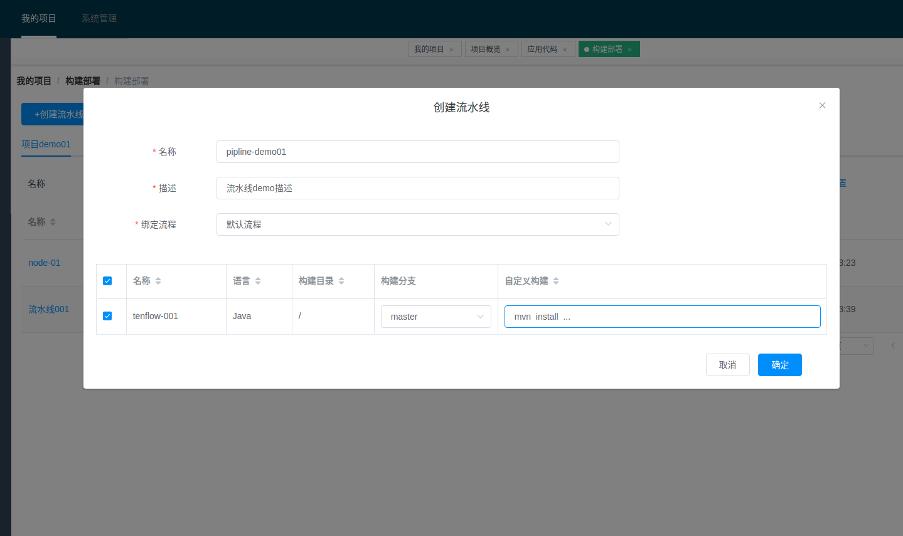

# 快速开始

## 视频介绍

<iframe src="//player.bilibili.com/player.html?aid=420715943&cid=413510859&page=1" scrolling="no" width="800px" height="600px" border="0" frameborder="no" framespacing="0" allowfullscreen="true"></iframe>

## 1. 服务集成配置

### 1.1 服务集成列表

### 1.2 新建-服务集成

#### kubernetes 配置集成

#### jenkins 配置集成

#### harbor 配置集成

::: tip

* 支持`kubernetes`、`jenkins`、`harbor` 这三种类型的配置集成；
* 必须配置至少一个`jenkins`、`harbor`, `kubernetes`类型可以根据需要添加；
* 另外 Jenkins 的 kubernetes 的授权配置请查看 [github](https://github.com/warm-native/docs/tree/master/topic002/deploy)

:::

## 2. 创建项目

## 3. 配置项目环境/项目流程

### 3.1 新建环境

### 3.2 新建流程

### 3.3 流程配置

## 4. 应用代码配置

### 4.1 关联代码仓库

### 4.2 同步代码源
> 

::: tip

* 目前支持 `gitlab`/`github`
* 输入`仓库的主地址`/`用户名`/`Token信息`即可完成同步，为了更多的维护代码安全，这些配置信息是项目纬度的，不同项目需要独立配置．

:::

### 4.3 应用编排配置

::: tip

* 应用编排yaml为云原生的kuernetes yaml模板．

:::

## 5.创建流水线

::: tip

* 流水线创建好后，根据流水线的不同的阶段会显示允许的`操作`动作,

:::

## 6.应用服务

::: tip

* 应用服务可以查看服务状态，水平扩展，重启，删除等．　
 
:::
